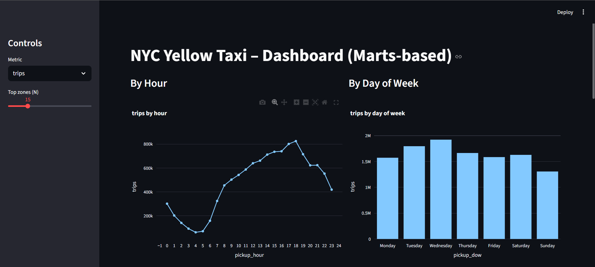
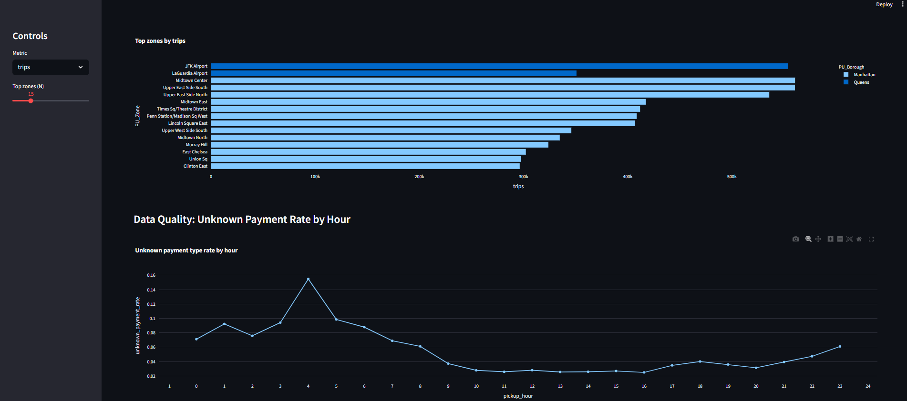
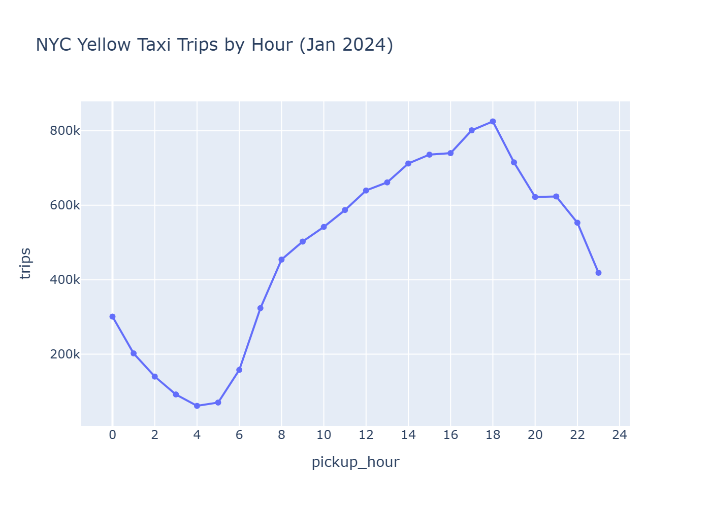
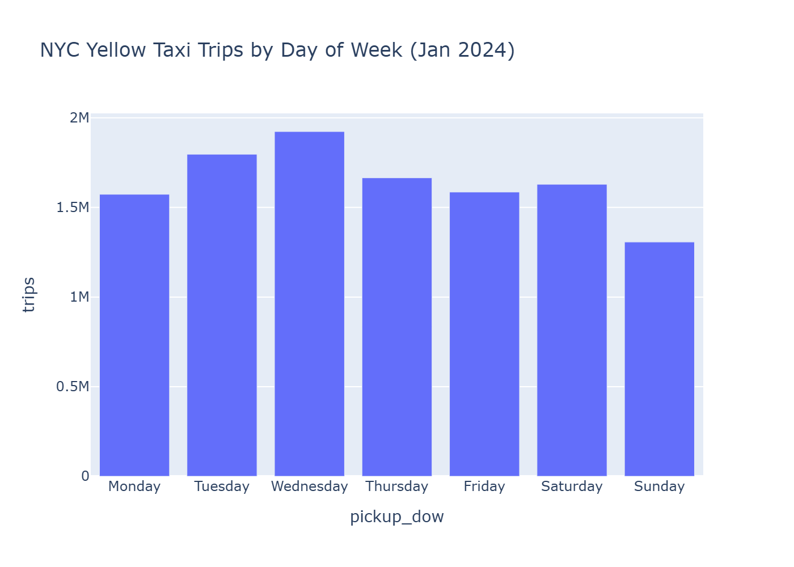
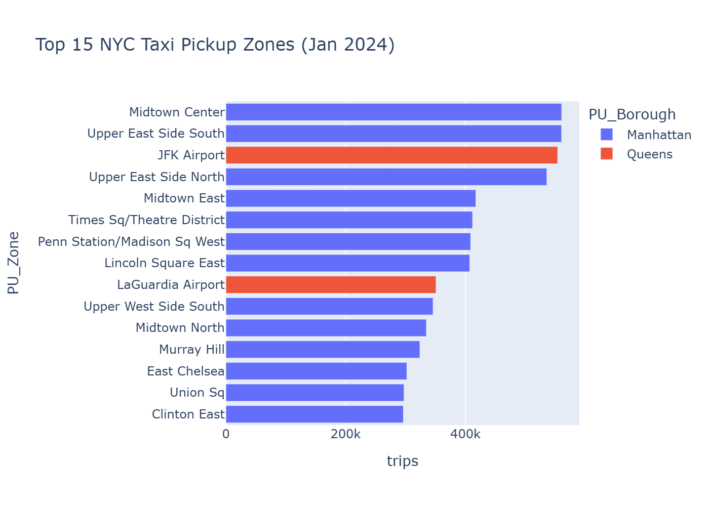
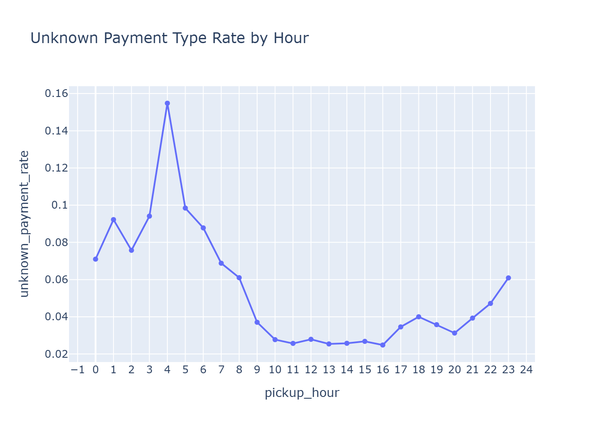

# NYC Taxi Data Quality + Demand Insights

## Goal
Build a reproducible analytics pipeline (Pandas → Parquet → PySpark) that cleans real-world trip data, generates actionable insights, and powers dashboards + a simple Retool app.

## What this project demonstrates
- **Pandas + NumPy:** cleaning, feature engineering, quality checks
- **Parquet:** efficient storage, consistent schema, partitioned outputs
- **PySpark:** scalable version of the pipeline (local Spark)
- **Jupyter:** analysis narrative + reproducibility
- **Retool (later):** app layer on top of cleaned/aggregated outputs

## Core questions
1. When are the peak pickup hours, and how do they vary by day of week?
2. Which pickup zones generate the most trips, and how does that change over time?
3. What are typical trip distance, duration, and fare patterns (and how do they differ by zone)?
4. What outliers exist (impossible durations/distances/fares), and how many rows do quality rules remove?
5. What “dashboard-ready” tables best support fast filtering and drill-down?
## Status
- Built marts in Pandas and reproduced them in PySpark local mode
- Resolved Windows Spark native dependency (Hadoop winutils + DLL), enabling Parquet reads
## Dashboard Snapshots

### Streamlit App1


### Streamlit App2


### Trips by Hour


### Trips by Day of Week


### Top Pickup Zones


### Data Quality: Unknown Payment Rate


## Repo structure
- `notebooks/` → EDA, cleaning rules, insights
- `src/` → reusable scripts (cleaning + Spark pipeline)
- `docs/` → data dictionary + quality rules
- `dashboards/` → screenshots / notes
- `data/` → local only (ignored by git)

## How to run
```bash
conda env create -f environment.yml
conda activate taxi-analytics
jupyter lab
