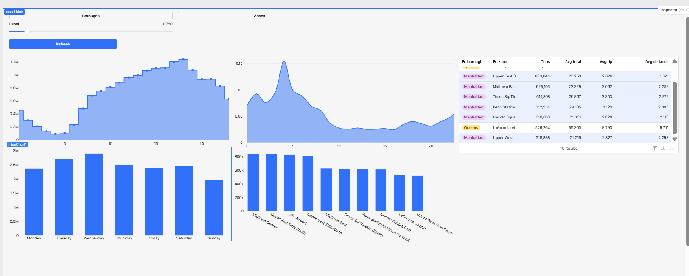

# NYC Taxi Data Quality + Demand Insights

## Goal
Build a reproducible analytics pipeline (Pandas → Parquet → PySpark) that cleans real-world trip data, generates actionable insights, and powers dashboards + a simple Retool app.

## What this project demonstrates
- **Pandas + NumPy:** cleaning, feature engineering, quality checks
- **Parquet:** efficient storage, consistent schema, partitioned outputs
- **PySpark:** scalable version of the pipeline (local Spark)
- **Jupyter:** analysis narrative + reproducibility
- **Retool (later):** app layer on top of cleaned/aggregated outputs

## Core questions
1. When are the peak pickup hours, and how do they vary by day of week?
2. Which pickup zones generate the most trips, and how does that change over time?
3. What are typical trip distance, duration, and fare patterns (and how do they differ by zone)?
4. What outliers exist (impossible durations/distances/fares), and how many rows do quality rules remove?
5. What “dashboard-ready” tables best support fast filtering and drill-down?

## NYC Taxi Analytics Pipeline (Pandas + PySpark + Parquet + Streamlit + Retool)

End-to-end analytics project using NYC Yellow Taxi trip data:
- Cleaned and validated ~3M trips with transparent hard vs soft data-quality rules
- Exported partitioned Parquet for scalable processing
- Built dashboard-ready marts in both Pandas and PySpark (local mode)
- Delivered dashboards in Plotly (notebook) + Streamlit (app)
- Published Retool-ready tables (CSV + Parquet) and built a Retool dashboard app

## What this project demonstrates
- Built a reproducible analytics pipeline (Conda env + scripts + notebooks)
- Cleaned ~3M NYC taxi trips using transparent hard vs soft quality rules
- Exported partitioned Parquet for scalable processing
- Reproduced marts in both Pandas and PySpark (local mode)
- Built dashboards in Plotly (notebook) and Streamlit (app)
- Published Retool-ready tables (CSV + Parquet) with a clear data contract
  
## Key stats (Jan 2024)
- Raw trips: 2,964,624
- Clean trips: 2,869,996 (3.192% removed via hard-invalid rules)
- Unknown payment type: 115,239 trips kept but flagged (data-quality transparency)

## Published tables (Retool-ready)

The pipeline publishes clean, dashboard-ready tables to `data/published/` in both Parquet and CSV:

- `dim_zones` — taxi zone lookup
- `mart_hour` — trips + averages by hour
- `mart_dow` — trips + averages by weekday
- `mart_zone` — demand + revenue metrics by pickup zone
- `mart_quality_hour` — unknown payment rate by hour

## Published tables (Retool-ready)

Tables are published to `data/published/` as both Parquet and CSV:
- `dim_zones` — taxi zone lookup
- `mart_hour` — trips + averages by pickup hour
- `mart_dow` — trips + averages by weekday
- `mart_zone` — demand + revenue metrics by pickup zone
- `mart_quality_hour` — unknown payment rate by hour

## Dashboard Snapshots

### Streamlit App1


### Streamlit App2


### Trips by Hour


### Trips by Day of Week


### Top Pickup Zones


### Data Quality: Unknown Payment Rate


## Retool App


## Repo structure
- `notebooks/` → EDA, cleaning rules, insights
- `src/` → reusable scripts (cleaning + Spark pipeline)
- `docs/` → data dictionary + quality rules
- `dashboards/` → screenshots / notes
- `data/` → local only (ignored by git)

## How to run

```bash
conda activate taxi-analytics

# 1) Clean + export partitioned parquet
python src/export_parquet.py

# 2) Build marts with Spark
python src/spark_mart.py

# 3) Publish Retool-ready outputs
python src/publish_marts.py

# 4) Streamlit dashboard
streamlit run app.py
